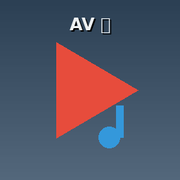
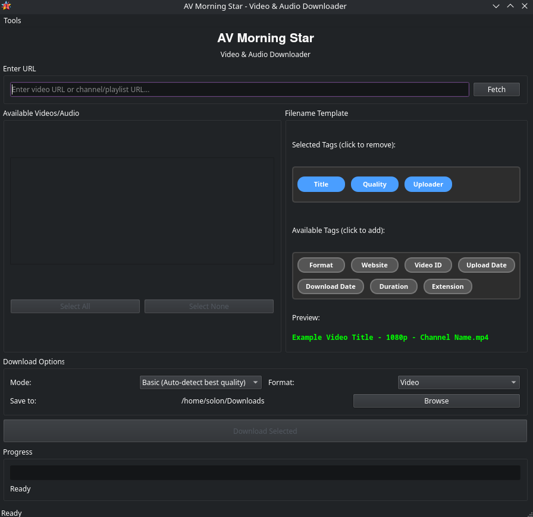

<div align="center">



# AV Morning Star

**Video & Audio Downloader for Linux**

[](https://github.com/asafelobotomy/AV-Morning-Star/releases)
[](LICENSE)
[](https://www.python.org/downloads/)
[](#)
[](#)

[**⬇ Download AppImage**](https://github.com/asafelobotomy/AV-Morning-Star/releases/latest) · [Documentation](docs/README.md) · [Report a Bug](https://github.com/asafelobotomy/AV-Morning-Star/issues)

</div>

---

AV Morning Star is a desktop application for downloading video and audio from YouTube, Odysee, and 1000+ other sites. It wraps [yt-dlp](https://github.com/yt-dlp/yt-dlp) in a clean PyQt5 GUI, adds smart YouTube authentication, real-time progress, audio/video post-processing, and a flexible filename template system — all packaged as a self-contained Linux AppImage.

---

## Screenshots

<div align="center">

<p><em>Main window — dark mode (default). Light mode available via View menu.</em></p>
</div>

---

## Features

### Downloading
- **Video** — Best, 4K, 1440p, 1080p, 720p, 480p, 360p
- **Audio extraction** — MP3, AAC, FLAC, Opus, M4A, WAV, ALAC with bitrate selection
- **Playlists & channels** — fetch all entries, select the ones you want
- **Subtitle embedding** — download and mux subtitles automatically
- **1000+ sites** — anything yt-dlp supports, including YouTube, Vimeo, Twitch, Odysee, Twitter/X, TikTok, and more

### YouTube Authentication
- **Cookieless by default** — no authentication until YouTube requires it
- **Smart browser detection** — auto-selects the browser where you're already logged in
- **Supported browsers** — Firefox, Chrome, Brave, Edge, Chromium, Opera, Vivaldi
- **User-consent model** — prompts before reading any browser cookies
- **In-memory only** — cookies are never written to disk by this app

### Audio Enhancement (Advanced mode)
- EBU R128 broadcast loudness normalisation
- Dynamic normalisation for varying-volume content
- FFT-based noise reduction
- Thumbnail / album-art embedding

### Video Enhancement (Advanced mode)
- Temporal denoising (`hqdn3d`) for grainy footage
- Camera-shake stabilisation (`deshake`)
- Edge-aware sharpening (unsharp mask)
- Audio post-processing on video tracks
- Output containers: MP4, MKV, WebM, MOV, AVI, FLV

### Filename Templates
Click tags to compose the output filename. Supported tokens:

| Token | Example value |
|---|---|
| Title | `Amazing Video` |
| Uploader | `Channel Name` |
| Quality | `1080p` |
| Format | `mp4` |
| Website | `YouTube` |
| ID | `dQw4w9WgXcQ` |
| Upload Date | `20260603` |
| Timestamp | `1749000000` |
| Duration | `03:45:20` |
| Extension | `mp4` |

### Interface
- **Dark / Light theme** — toggle any time via View menu
- **Basic mode** — one-click download, auto-detects best quality
- **Advanced mode** — full control over codecs, bitrates, and post-processing
- **Real-time progress** — live filename, percentage, and status updates

---

## Installation

### AppImage (recommended)

```bash
# Download
wget https://github.com/asafelobotomy/AV-Morning-Star/releases/download/v0.4.1/AV-Morning-Star-0.4.1-x86_64.AppImage

# Make executable and run
chmod +x AV-Morning-Star-0.4.1-x86_64.AppImage
./AV-Morning-Star-0.4.1-x86_64.AppImage
```

The AppImage is self-contained (~63 MB). It requires:
- **FFmpeg** — for audio/video processing
- **Deno**, **Node.js 22+ LTS**, or another JS runtime — for YouTube PO token generation (recommended; app works without it but YouTube reliability improves significantly)

Install FFmpeg:

```bash
# Debian/Ubuntu
sudo apt install ffmpeg

# Fedora
sudo dnf install ffmpeg

# Arch
sudo pacman -S ffmpeg
```

### From Source

```bash
git clone https://github.com/asafelobotomy/AV-Morning-Star.git
cd AV-Morning-Star
chmod +x start.sh && ./start.sh
```

`start.sh` creates a virtual environment, installs dependencies, and launches the app.

**Manual steps:**
```bash
python3 -m venv .venv && source .venv/bin/activate
pip install -r requirements.txt
python3 main.py
```

**Requirements:** Python 3.10+, FFmpeg, and optionally a JS runtime for YouTube.

### Build AppImage from Source

```bash
chmod +x scripts/build-appimage.sh
./scripts/build-appimage.sh
```

Outputs `AV-Morning-Star-<version>-x86_64.AppImage` in the project root.

---

## Usage

```
1. Launch             →  ./AV-Morning-Star-0.4.1-x86_64.AppImage
2. Set authentication →  Tools > Preferences  (leave on "Auto" by default)
3. Paste a URL        →  YouTube playlist, Odysee channel, any supported site
4. Click Fetch        →  Retrieves title, duration, and uploader for each item
5. Select videos      →  Check the ones you want
6. Choose settings    →  Mode, quality, format (Basic mode does this automatically)
7. Click Download     →  Files saved to your chosen output directory
```

### YouTube Authentication

For most videos no login is needed. When YouTube requires authentication:

1. Make sure you are logged into YouTube in your browser
2. Open **Tools → Preferences** and ensure Authentication is set to **Auto (Recommended)**
3. Re-fetch — the app will detect your browser and ask for confirmation before using cookies

---

## Architecture

```
AV-Morning-Star/
├── main.py                  # GUI application (PyQt5)
├── threads.py               # URLScraperThread and DownloadThread workers
├── dialogs.py               # Preferences and other dialogs
├── ui_widgets.py            # FlowLayout, VideoCheckbox, pixmap helpers
├── settings.py              # Persistent user preferences (QSettings)
├── themes.py                # Dark + Light theme definitions (QSS)
├── constants.py             # Shared string constants
├── browser_utils.py         # Browser cookie detection
├── extractors/
│   ├── base.py              # BaseExtractor interface
│   ├── youtube_ytdlp.py     # YouTube (PO token support)
│   ├── podcast_page.py      # Podcast RSS feeds
│   └── generic.py           # Fallback (Odysee + 1000+ yt-dlp sites)
├── scripts/
│   └── build-appimage.sh    # Reproducible AppImage build
├── tests/                   # 124 unit tests (unittest)
└── packaging/               # .desktop and AppStream metadata
```

**Threading model:** the GUI runs on the main thread. Metadata fetching (`URLScraperThread`) and downloads (`DownloadThread`) each run on separate worker threads and communicate back via PyQt signals.

**Adding a new platform:** create `extractors/yourplatform.py` inheriting `BaseExtractor`, implement `extract_info()` and `get_download_opts()`, then register the URL pattern in `extractors/__init__.py`. No changes to `main.py` needed. See [docs/ARCHITECTURE.md](docs/ARCHITECTURE.md).

---

## Security & Privacy

| Property | Detail |
|---|---|
| Cookieless by default | Authentication only triggered when the site requires it |
| In-memory cookies | Browser cookies are never written to disk by this app |
| Read-only browser access | Cannot modify your browser's stored data |
| User consent | Prompts before reading any browser session |
| No telemetry | Zero analytics, no network calls except to the download target |
| Open source | Inspect the code at any time |

See [docs/SECURITY_AND_PRIVACY.md](docs/SECURITY_AND_PRIVACY.md), [docs/SECURITY_AUDIT.md](docs/SECURITY_AUDIT.md), and [SECURITY.md](SECURITY.md) for full detail.

---

## Troubleshooting

| Problem | Solution |
|---|---|
| "Sign in to confirm you're not a bot" | Log into YouTube in your browser; set Auth to Auto in Preferences |
| "Browser cookies not found" | Close the browser, reopen, retry; or switch to Auto mode |
| "FFmpeg not found" | Install FFmpeg via your package manager (see above) |
| "No JavaScript runtime found" | Install Deno (`snap install deno`) or Node.js 22+ LTS |
| Download stuck / very slow | Check connection; try a different quality setting |
| "Requested format not available" | Choose a lower quality; the video may have limited formats |

---

## Documentation

| Guide | Contents |
|---|---|
| [Getting Started](docs/GETTING_STARTED.md) | Step-by-step first-run walkthrough |
| [Authentication Guide](docs/AUTHENTICATION_GUIDE.md) | YouTube cookie authentication in depth |
| [Smart Browser Detection](docs/SMART_BROWSER_DETECTION.md) | How auto browser selection works |
| [Security & Privacy](docs/SECURITY_AND_PRIVACY.md) | User-facing security explanation |
| [Architecture](docs/ARCHITECTURE.md) | Extractor system and threading model |
| [Project Structure](docs/PROJECT_STRUCTURE.md) | Every file explained |
| [Security Audit](docs/SECURITY_AUDIT.md) | Technical security review |
| [CHANGELOG](CHANGELOG.md) | Version history |
| [Constants Reference](docs/CONSTANTS.md) | `constants.py` module documentation |

---

## Contributing

Pull requests are welcome. Please:

1. Run the test suite before submitting: `python3 -m unittest discover -s tests -p "test_*.py"`
2. Add or update tests for any changed behaviour
3. Keep changes focused — one concern per PR

---

## License

This project is licensed under the **MIT License**. See [LICENSE](LICENSE) for the full text.

---

## Credits

- [yt-dlp](https://github.com/yt-dlp/yt-dlp) — video downloading engine
- [PyQt5](https://www.riverbankcomputing.com/software/pyqt/) — GUI framework
- [FFmpeg](https://ffmpeg.org/) — audio/video processing
- [Deno](https://deno.com/) — JavaScript runtime for YouTube PO tokens

---

> **Disclaimer:** This tool is for personal, lawful use only. Respect copyright law, website terms of service, and creator permissions. The authors are not responsible for misuse.

<div align="center"><sub>AV Morning Star v0.4.1 · Linux x86_64</sub></div>
